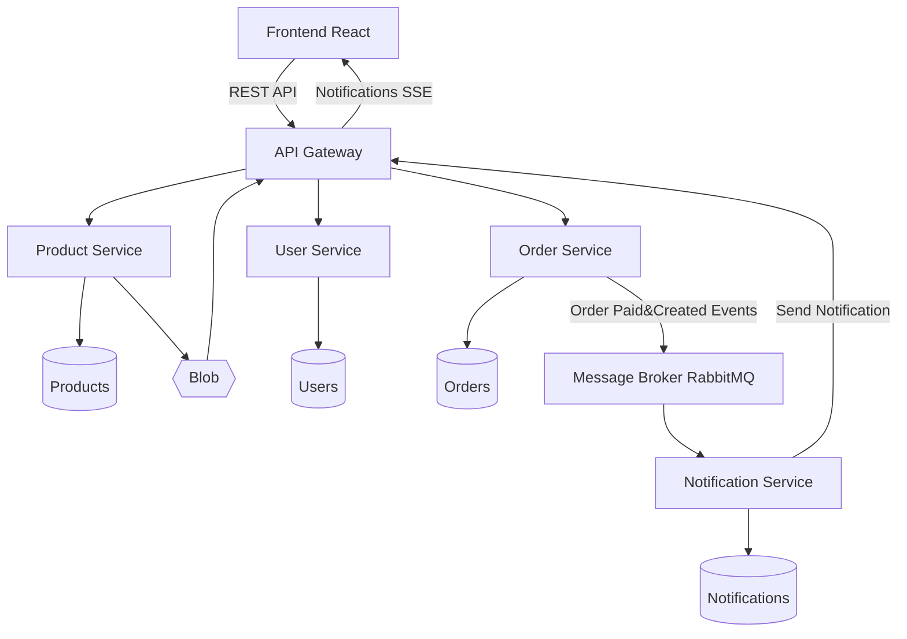

# MSC in Computer Engineering - Mobile Computing - 1st Project

### Student: 2240198 -  Pedro Henrique Silva Chianca Fernandes

#### **Microservices-Based E-Commerce Application**

##### **1. Project Overview**

This project consists of transforming a monolithic e-commerce web application ([Basir - Project](https://github.com/basir/node-react-ecommerce)) into a distributed system based on a **microservices architecture**, using Docker and Docker Compose.

The application will allow users to browse products, manage accounts, and place orders, while internally leveraging multiple independent services to ensure scalability and modularity.

---
## Architecture Overview


---
## Microservices Breakdown

### Frontend
- From the original React application the following changes were done:
    - Added Paypal configuration
    - Added Notifications module
    - Usage of azure blob storage to get Images via API Gateway.

### Backend

- Common infrastructure
    - Mongo DB Server
        - Notifications
        - Users
        - Products
        - Orders

    - Status endpoint
        - To enable future health checks (not done)
    - API Gateway routing:
        - Use nginx for routing.

#### Products Service
- Blob Storage (Azurite an Azure blob storage emulator)
    - Available via API Gateway

#### Orders Service
- Rabbit MQ:
    - Order created
    - Order paied
- Paypal config discovery endpoint

#### Notifications Service
- Rabbit MQ
    - Receive Order events
- Notifications Database:
    - RegisteredUsers
    - Notifications (sendTo/delivered)
- SSE:
    - Register user sessions
    - Notify client app

----
## Deployment & Docker

Each service runs in its own container and is defined in `docker-compose.yml`.

### Setup

The project uses **two Compose files**:
- `docker.compose.yml` — production configuration: builds every service, no host-exposed ports for internal services, static frontend served by nginx.
- `docker.compose.dev.yml` — development overrides: exposes all service ports to the host for direct debugging, mounts frontend source for hot-module replacement (HMR), and re-exposes the RabbitMQ management UI.

Run both together:
```bash
docker compose -f docker.compose.yml -f docker.compose.dev.yml up --build
```

### Services Orchestration

| Container | Role |
|---|---|
| `mongo-db` | Shared MongoDB instance for all services |
| `users-service` | Handles authentication & user data |
| `products-service` | Manages catalogue + Azure Blob (Azurite) |
| `orders-service` | Processes orders, publishes RabbitMQ events |
| `notifications-service` | Consumes events, delivers SSE to the frontend |
| `rabbitmq` | Async message broker between Orders and Notifications |
| `api-gateway` (nginx) | Single entry point — routes all REST + SSE traffic |
| `frontend` | React SPA (static build in prod / CRA dev server in dev) |

Startup order is enforced via `depends_on`, and RabbitMQ uses a **healthcheck** so `notifications-service` only starts once the broker is ready.

### Key Benefits

- **Isolation** — each service has its own process, dependencies, and can fail independently without bringing down the entire application.
- **Scalability** — individual services can be scaled horizontally (`docker compose up --scale products-service=3`) without touching the rest of the stack.
- **Easy setup** — a single command (`docker compose up --build`) reproduces the full environment on any machine with Docker installed, eliminating "works on my machine" problems.

---
## Challenges & Conclusion

### Challenges

1. **Asynchronous startup ordering** — RabbitMQ takes a few seconds to become ready after its container starts. Services that connect to it on boot would crash-loop until the broker was accepting connections. Solved by adding a `healthcheck` to the RabbitMQ service and a `condition: service_healthy` dependency in `notifications-service`, so Compose waits for a clean ping before launching the consumer.

2. **Cross-container networking in development** — The frontend dev server (CRA) runs inside Docker and needs to reach the API Gateway container, while the host browser also needs to access both the app and the gateway. Mapping the right ports between host, the nginx container, and the CRA container, and keeping CORS and proxy rules consistent across environments, required careful alignment of the `setupProxy.js` config and the Compose port mappings.

3. **Blob storage access** - The backend stores the image url based on docker networking url. However, the frontend needs to be able to access it from client's network. A workaround was done to resolve this, in the frontend the original image url is replaced by the api-gateway address.

4. **Server Sent Events Notifications** - 

### Challenges

- Docker Compose's override file pattern (`-f base.yml -f override.yml`) is a clean way to share a common topology between production and development without duplicating configuration.
- Docker profile, as I faced a problem with the hot reloading approach, I had to wrap it in a profile [frontend]
- Creating a production 'almost' ready setup. Accessing different resources via a single api gateway to expose securely your application.

### Possible Improvements

- Add **health-check endpoints** to every service and wire them into an orchestrator (Kubernetes) for automatic restarts and traffic routing.
- Introduce a **dedicated API Gateway** (e.g., Kong or AWS API Gateway) to handle authentication, rate-limiting, and routing in one place instead of a hand-rolled nginx config.
- Replace the Azurite emulator with a real Azure Blob Storage account and manage secrets via environment variables or a vault, making the storage layer production-ready.
- Add a log collector&indexer such as graphana or azure aspire dashboard to collect and analise system performance and enhance observability.
