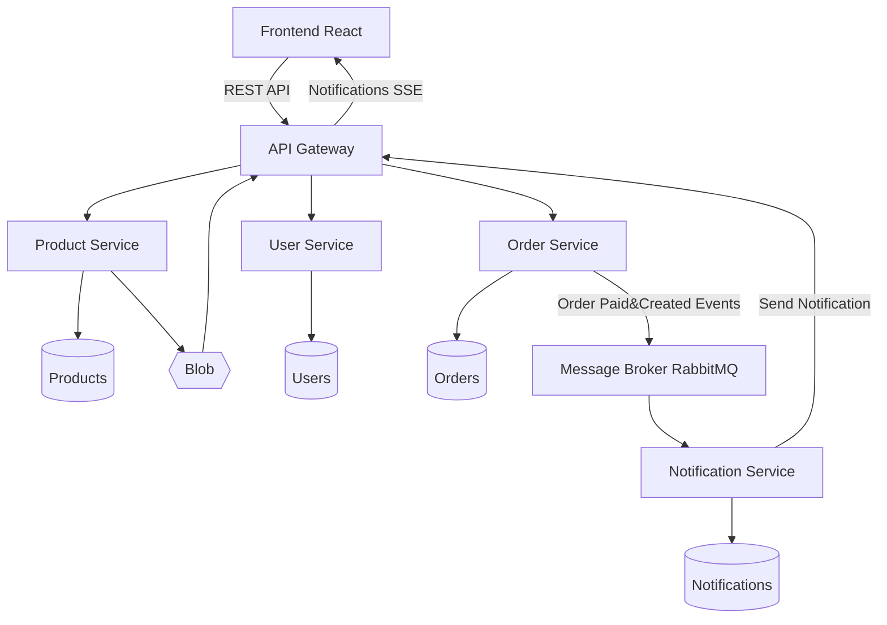

# Microservices Architecture – E-Commerce Application

# **Preliminary Architecture Plan – Microservices-Based E-Commerce Application**

## **1. Project Overview**

This project consists of transforming a monolithic e-commerce web application into a distributed system based on a **microservices architecture**, using Docker and Docker Compose.

The application will allow users to browse products, manage accounts, and place orders, while internally leveraging multiple independent services to ensure scalability and modularity.

---

## **2. Base Application**

The starting point is a monolithic e-commerce application based on:

* Frontend: React
* Backend: Node.js (Express)
* Database: MongoDB

The system will be refactored into independent microservices, each responsible for a specific domain.

---

## **3. Proposed Microservices Architecture**

The system will be decomposed into the following services:

### **3.1 Frontend Service**

* Technology: React
* Responsibilities:

  * User interface
  * Communicates with API Gateway via HTTP

---

### **3.2 API Gateway**

* Technology: Node.js (Express)
* Responsibilities:

  * Single entry point for all client requests
  * Request routing to internal services
  * Authentication and request validation

---

### **3.3 User Service**

* Responsibilities:

  * User management
  * Authentication (JWT)
  * Roles and permissions
* Database: Dedicated database instance

---

### **3.4 Product Service**

* Responsibilities:

  * Product catalog management
  * Categories and product data
* Database: Dedicated database instance

---

### **3.5 Order Service**

* Responsibilities:

  * Shopping cart management
  * Order processing
* Database: Dedicated database instance

---

### **3.6 Notification Service (Asynchronous)**

* Responsibilities:

  * Sending notifications (e.g., order confirmation)
* Communication:

  * Consumes messages from a message broker (RabbitMQ)

---

### **3.7 Real-Time Communication Service**

* Technology: WebSockets (Socket.IO)
* Responsibilities:

  * Deliver real-time updates (e.g., order status)

---

### **3.8 Infrastructure Services**

* **Database**: MongoDB (one or multiple instances)
* **Message Broker**: RabbitMQ (for asynchronous communication)

---

## **4. Communication Patterns**

### **4.1 Synchronous Communication**

* REST APIs over HTTP
* Used between:

  * Frontend → API Gateway
  * API Gateway → Microservices

---

### **4.2 Asynchronous Communication**

* Message-based communication using RabbitMQ
* Example:

  * Order Service publishes an “Order Created” event
  * Notification Service consumes the event

---

### **4.3 Real-Time Communication**

* WebSocket-based communication
* Used for:

  * Live order updates
  * User notifications

---

## **5. Containerization Strategy**

Each service will be:

* Packaged with its own Dockerfile
* Deployed as an independent container

All services will be orchestrated using **Docker Compose**, including:

* Application services
* Databases
* RabbitMQ

---

## **6. Data Management**

* Each microservice will manage its own database (database-per-service pattern)
* Data consistency between services will be handled via asynchronous events where necessary

---

## **7. Additional Features (Planned)**

To enhance the project:

* File upload support for product images (using Docker volumes)
* Integration with an external payment API (e.g., Stripe sandbox)

---

## **8. Expected Benefits**

* Improved scalability and modularity
* Clear separation of concerns
* Demonstration of real-world distributed system patterns:

  * API Gateway
  * Event-driven architecture
  * Real-time communication

---

## **9. Open Points for Discussion**

* Whether to use a single database instance or multiple per service
* Level of complexity for the API Gateway (simple routing vs full BFF pattern)
* Scope of real-time features

---

## **10. Conclusion**

This architecture satisfies all project requirements, including:

* At least 5 microservices
* Synchronous and asynchronous communication
* Real-time capabilities
* Full containerization using Docker

It also leaves room for future scalability and additional features.

---

